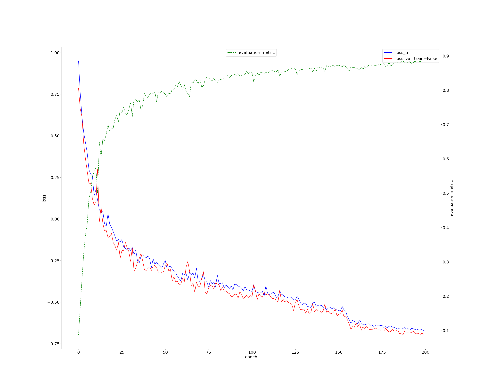

# mitral analyze

The code mainly uses the nnUNet framework https://github.com/MIC-DKFZ/MedNeXt

# Model Training
We utilized the MedNeXt framework and tested the results under S3, S5, B3, B5, and M3 models respectively. Here, we provide the results obtained from training on a partial dataset using the S3 model, which achieved relatively high DICE scores.


The DICE values for both the anterior and posterior mitral valve leaflets exceed 0.85.

# Segmentation Capabilities
Our network successfully segments a wide range of cardiac structures, including but not limited to:
- Aorta
- Aortic valve
- Right atrium
- Left ventricle
- Left ventricular myocardium
- Papillary muscles
- Left atrium
- Anterior mitral valve leaflet
- Posterior mitral valve leaflet
- Left and right coronary arteries
- Left circumflex artery
- Coronary sinus
- Calcifications


# Release
We have made public the following components:

1.Measurement and Calculation Framework: A comprehensive codebase for various cardiac measurements.

2.Diverse Measurement Algorithms: Implementations for calculating a wide range of metrics, including but not limited to:
- Annulus dimensions
- Anteroposterior (AP) diameter
- Commissure-to-commissure (CC) diameter
- Tenting height (TH)
- Leaflet lengths
- Left atrial analysis
- Papillary muscle analysis
 


These tools provide a solid foundation for advanced mitral valve analysis in medical imaging.

# Prerequisites
- Python 3.9

# Installation
1.Clone the repository:
```
git clone https://github.com/Saint-Twmx/mitral
cd mitralvalve-project
```

2.Set up the environment:
```
python setup.py install
```
This will automatically install all required dependencies.

# Running the Project
1.Place your test data in the input folder within the project directory.
2.Run the main script:
```
python run.py
```
3.The script will automatically:
- Read test data from the input folder
- Perform segmentation
- Conduct measurements
- Save results back to the input folder

# Output
After running the script, you can find the following in the input folder:
- Segmentation results
- Measurement data
- Any other output generated by the pipeline
